# P2: bounded goal-to-candidate execution

Status: Sol G1R APPROVE / READY_FOR_P2_BUILDER; implementation underway. See `2026-09-16-dashboard-p2-g1r-review.md`. Builds on the uncommitted approved P0/P1 increment. This is implementation work, not another cosmetic milestone.

```mermaid
flowchart LR
  Project[Configured project] --> Draft[Durable goal and scope]
  Draft --> Plan[Review exact execution plan]
  Plan --> Start[Idempotent authorized start]
  Start --> Snapshot[Separate bounded project snapshot]
  Snapshot --> Provider[Owned provider returns file contents]
  Provider --> Validate[Validate and write candidate]
  Validate --> Check[Owned trusted check command]
  Check --> Evidence[Seal signed result and artifacts]
  Evidence --> Result[Candidate ready or explicit failure]
```

## Outcome and boundary

A configured installation can select an approved project in the dashboard, save a goal, review its exact scope/policy, start once, and obtain actual generated or edited files plus a real check command result without manually creating a run or certificate. P2 finishes at a verified candidate in a separate workspace. It never represents this as application to the original project. P3 owns diff/refinement/accept/application UX and the separate governed primary-tree transaction; no primary writes or approval-to-completed shortcut is added here.

Initial bounded execution uses structured file generation: the provider produces contents, while TORQ controls filesystem writes and check commands. It does not need an unrestricted agent shell. The UI names the supported check precisely (syntax/format validation is not unit testing). Broader execution policies must not be advertised as implemented.

## Control and data contract

1. Add an explicit task-capable launch configuration with server-approved project directories and a separate state root. Default state may be automatic outside the project. Project selection uses opaque IDs; HTTP never accepts arbitrary absolute directories or executable paths. Existing Fleet launch remains compatible. Opening the page never calls a provider.
2. Preserve discussion separately from New task. Task capabilities report provider configuration, supported execution policy, project eligibility, and active-task ownership independently of an existing Fleet run certificate. This is a new authorized task-creation path, not a bypass of the existing chat trust gate.
3. Persist drafts server-side with revision CAS, project binding, bounded contents, explicit delete, and honest persistence text. Retain them across server restart. Do not insert unsent drafts into run receipts. Browser edits during requests must not be cleared by an older acknowledgement.
4. A reviewable plan binds goal/draft revision, project ID, input snapshot identity, allowed output paths/scope, provider/model, check policy, and limits. An immutable plan digest is required on Start. Source or policy changes invalidate that plan. Approval authorizes provider submission and generation only in the displayed scope.
5. Start commits a durable reservation before any provider dispatch. A request ID plus canonical request digest identifies retries; the same key/body returns the same task and a different body conflicts. Simultaneous starts and multiple server processes cannot dispatch twice. State root has a kernel-backed single-owner lock. Interrupted reservations are recovered conservatively without automatic redispatch.
6. Each task gets a server-generated run ID, broker-created certificate/receipt store, isolated workspace and artifact directory. Reuse the broker/key/receipt authority path. Signed task-specific evidence must bind the accepted plan, base manifest, provider result identity, candidate manifest and exact check result. Result projection must validate semantic task state as well as cryptographic verification; generic signed audit prose is not alone a completion proof. No false v3 primary application claim.
7. Provider execution uses the existing credential boundary and OwnedProcess. Use a separate immutable runtime directory outside both source and evidence. Return a closed bounded JSON schema containing actual relative paths and UTF-8 file contents; reject duplicate keys/paths, invalid schema, path escape, protected paths, excessive output and unsupported operations. Provider output cannot choose executable argv or read arbitrary local files. Do not expose raw provider stderr or secrets to HTTP.
8. Snapshot selected ordinary files into a new owner-only candidate; reject links, reparse points, special files, traversal, Windows device/ADS paths and case aliases. Source, state, work and provider directories must not overlap. No keys, credentials, .git or protected source are copied or submitted. Bound file count, file size, total bytes and traversal work. The reviewed plan clearly states exclusions and supported scope. Recheck the source snapshot before dispatch and candidate identity before declaring ready.
9. Execute a fixed packaged check helper through OwnedProcess with no provider credentials and isolated Python imports. Initial policy may validate Python syntax and JSON/text format without importing/executing generated code. Record actual argv/command identity, exit code, output completeness and confirmed process-tree termination. Missing/failed checks cannot produce candidate_ready. Do not call process ownership an OS filesystem sandbox.
10. Progress uses durable states (reserved, preparing, generating, checking, candidate_ready, failed, interrupted, stop_requested/termination_unknown). Cancel and shutdown operate only on owned process trees. Unknown termination prevents successful cancellation and blocks another task until safe recovery. Reconnect/restart must not replay a provider call. Completed candidates remain addressable by task ID and pinned evidence/artifact identities; missing or changed evidence/artifacts downgrades the result.

### Exact-content restriction (Terra design review)

The initial policy accepts UTF-8 regular-file contents only. Scan source context before provider submission and candidate contents before writing, using the existing redaction registry, and require unchanged text; findings that alter text are a hard rejection, never a repair. Hash the exact UTF-8 bytes before artifact persistence. After broker `write_artifact`, decrypt/read back and require byte-for-byte equality. Signed task evidence binds raw content and encrypted artifact hashes. UI/plan states that secret-like output rejected by the scanner cannot be generated under this policy. No base64 workaround or misleading claim of a general binary artifact channel. Reject hardlinks and special filesystem nodes as well as links/reparse points; represent only regular-file changes and do not promise empty-directory changes. Recheck original source identity before candidate_ready as well as before dispatch.

## Closed contracts required by G1R

### Installation identity

One state root is the installation authority for draft/task/request idempotency and the lifetime kernel lock. Deliberately different state roots are different installations and do not share idempotency. Derive separate sibling `state` and `work` directories under an automatic application-data parent (or accept explicit `--task-state-root` and `--task-work-root`), with the provider runtime in a third owner-only temporary root. Validate pairwise source/state/work/provider-runtime ancestor and case aliases before mutation. Evidence lives inside state; candidate work lives inside work. Do not interpret the state/evidence containment as prohibited: the disjointness applies to the named top-level trust boundaries.

### Evidence lifecycle

Use the existing receipt envelope/certificate/broker with `task_contract=torq-candidate-task-v1` and a closed inner `event`. The existing outer `audit` transition is reused as an observed coordinator event. Its discriminator selects a strict closed event schema and semantic state machine in BOTH append and independent verification paths, including task-ID consistency and exactly one terminal before seal. The semantic validator derives readiness; generic/non-discriminated audit receipts never count. Old cryptographic verification alone cannot project P2 readiness. Missing/unknown discriminator data cannot become P2 evidence by projection.

The exact logical events are: `task_start_accepted` (request digest, immutable plan hash, scoped base manifest hash, canonical provider-input bundle hash); `candidate_generated` (accepted-plan identity, actual candidate manifest hash, encrypted candidate bundle reference and raw/cipher hashes); `candidate_check_completed` (generated sequence/hash, candidate hash, checker profile/version and executable helper hash, fixed argv identity, actual exit code, bounded output identity, output completeness and confirmed tree termination); `candidate_ready` (derived terminal linking all preceding evidence sequences/hashes and matching source recheck); and explicit failed/interrupted/cancelled terminals. At most one start, generated and check event per task in v1, in that order; ready requires all, check exit zero, unchanged source, complete output and confirmed termination. Failure can terminate an earlier phase; cancelled requires confirmed termination. Unknown termination is not cancelled and blocks new dispatch. Append and verification reject reorder, replay, duplicate terminal and post-terminal evidence. Seal once at a terminal. The result projector derives state from verified receipts and exact artifacts, never trusts the mutable task cache for readiness.

`candidate_ready` seals an immutable P2 result. P3 will open a separate review/apply transaction bound to that result; P2 never calls the existing v2 approval resolver to obtain completed.

Failure terminal names are exactly `task_failed`, `task_interrupted`, and `task_cancelled`. Their closed payload keys are `task_contract`, `event`, `task_id`, `phase`, `reason_code`, `caused_by_sequence`, `provider_dispatch`, and `termination`. `phase` is one of reserved/preparing/generating/checking; reason_code is a bounded machine code (no prose, paths or provider stderr); caused_by_sequence is null before a first event or the preceding sequence otherwise; provider_dispatch is a boolean; termination is one of not_started/confirmed_empty/unknown. Cancelled requires confirmed_empty, or not_started with provider_dispatch=false. Interrupted/unknown can never project cancelled or ready. Unknown ownership remains a blocking recovery condition even if an interrupted evidence terminal is sealed.

### Provider input and output

The initial file policy is at most 32 files, 65,536 bytes per file and 2,097,152 aggregate bytes. The smaller per-file bound permits reuse of the existing native, ancestor-handle-protected reader without weakening its legacy configuration defaults. Provider wire output is separately bounded to 1,048,576 bytes including JSON overhead; the workspace limit is not a promise that every maximum-size file can be generated in one response.

The canonical input bundle contains the accepted plan and only explicitly scoped source paths, exact UTF-8 contents and hashes. Its canonical SHA-256 is in the accepted-start receipt. New output paths are explicitly allowed by the reviewed plan. No arbitrary project browsing or hidden source-context expansion.

Provider wire output is a single duplicate-key-free object with exactly `contract`, `plan_hash`, `input_hash`, and `operations`. `contract` is `torq-candidate-output-v1`. Each wire operation has exactly `operation` (`create` or `replace`), `path`, `base_hash` (null only for create), and `content` (UTF-8 string). Input, plan and existing base hashes are supplied in the prompt for exact copying. The trusted host constructs a canonical result by adding `content_bytes` and `content_hash` from actual UTF-8 bytes, never asks the model to calculate them, and verifies all accepted plan/input/base identities. Signed evidence distinguishes host-derived hashes from provider assertions and pins the raw response identity. No delete, rename, binary or empty-directory operations in v1. Reject unknown keys, duplicate paths, non-NFC paths, case-fold aliases, unsupported extensions and stale base hashes. Operations cannot leave the exact approved output-path set. Generation must produce at least one actual changed file to report candidate_ready.

Implement a task-specific CandidateProviderCommandFactory with at least one production provider adapter. Reuse credential/process primitives, not the proposal-only Chat/Live behavior. Capability is false unless provider/model/binary/credential availability, project/scope, owned-process platform and packaged checker preflight succeed. Authentication remains unknown until a real request succeeds; capability/preflight must not advertise authenticated status from local configuration alone.

### Packaged checks

Pin `check_profile_id=structural-v1`. Server constructs argv equivalent to `[trusted_python, -I, -S, packaged_helper, ...host_owned_manifest_reference]`; request/model never supplies argv or helper path. Pin the helper bytes' SHA-256 in the plan and check evidence and recheck before launch. Parse `.py` with syntax compilation/AST only (never execute/import), `.json` as strict JSON, and supported plain text as UTF-8. The plan names exactly which validators apply and that unit/integration tests are not run by this policy. Use clean environment without provider credentials, cwd=candidate, bounded timeout/output, and OwnedProcess confirmed empty termination. Any unvalidated file or missing check prevents ready.

## Interface

Add bundled task UI/JS with a project selector, durable goal editor, explicit scope/check explanation, Review plan, Start, progress, Stop, task history and a result summary with output file names and command/exit result. Keep Fleet default for its existing launch; a task launch can open the task workspace. Show provider setup problems without losing drafts. Preserve 320px layout and keyboard access. Never display Accept, arbitrary shell execution, all-tests-passed, applied, or build parity unless implemented and evidenced.

## Delivery and tests

Builder owns implementation after G1R approval. Root verifies package/browser. Terra performs independent G2A review. No framework migration, push, merge, deployment, credential changes or implicit paid smoke.

Required integration oracle: exercise authenticated HTTP draft/plan/start using the production coordinator, a real OwnedProcess fixture provider returning actual file contents, the real checker subprocess and real broker. Verify files changed only in the candidate, original hashes unchanged, check exit observed, signed result resolves, and reload/restart returns the same task. Clearly label fixture generation rather than live vendor verification. Production provider command wiring is tested separately; a live vendor smoke can only be claimed if actually performed.

Negative cases: invalid project/root links and overlap before mutation; protected/path/device/case/size attacks; stale plan/draft; duplicate starts and changed replay body; crash at acceptance/before dispatch/after output; cancellation during generation/check; process termination uncertainty; nonzero check/invalid provider output/output overflow; missing/tampered artifacts and certificates; session/origin/unknown fields/oversized body; no provider calls from GET; no secret-bearing check environment; browser revision races, disconnect and storage errors.

Run affected complete chat/Fleet/task tests, meaningful real process integration on Windows, lint/type checks, package asset validation, and installed-wheel browser smoke. Expand to full repository tests because the change touches shared authority/transport paths. Report exact results and any untested live-vendor behavior.

## Design stress test

Verdict: RESHAPE the assumption that the existing proposal-only runner can build; add actual host-controlled candidate execution. The largest risk is a signed success record that does not prove the candidate bytes or check result. The acceptance oracle above must fail on substituted files, failed checks, interrupted dispatch and changed plan identity. Success means a generated, checked, evidence-bound candidate; original-project application is a separate claim and remains disabled.
