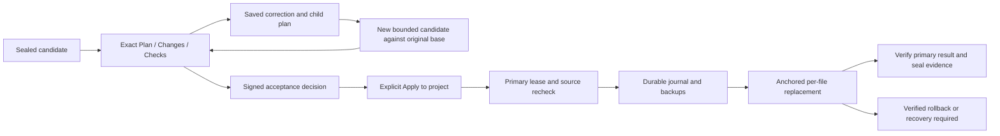

# P3: verified review, refinement, and explicit project application

Status: G1R approved, `READY_FOR_P3_BUILDER`; see `2026-09-16-dashboard-p3-g1r-review.md`. Baseline `e32ecdc` on `origin/main` (merged P2, PR #81). Working branch `feat/dashboard-p3-review-apply`. User authorizes implementation, testing, then commit/push and merge to main after required CI passes. This authorization does not turn dashboard Accept into an implicit Git action.

## Outcome, scope, and interpretation

The user can inspect an actual candidate diff and its check evidence, request a correction, find earlier tasks, accept the exact reviewed candidate, and explicitly apply it to the configured project. The prior UX plan's acceptance-only description is expanded here because the delivered P2 explanation reserved project application for P3. Acceptance and application remain separate claims and separate buttons. A completed provider process, verified candidate, accepted decision, and applied source are never conflated.

Keep P2's bounded UTF-8 create/replace policy: at most 32 files, 65,536 bytes per file, 2 MiB total, supported suffixes and secret/protected-path denial. No delete/rename operations, arbitrary shell, generated-code execution, project unit-test runner, credentials changes, autonomous Git operation, push/merge/deployment from the dashboard, or general IDE migration. The implementation is a separate candidate-review/application contract, not an implementation claim for the whole design-only schema-v3 governed-run orchestrator. Preserve existing run/chat transition behavior and never map an approval directly to completed.

## Verified artifact projection

Introduce a shared verified result resolver whose authoritative input is `(task_id, candidate_ready_sequence)`. Require a verified, sealed receipt store; the exact ready event and linked start/generated/check events; strict event semantics; cipher and plaintext hashes; matching task, plan, input, base, operation, candidate and check identities. Parse duplicate-free finite JSON with closed shapes. Resolve encrypted accepted-input, candidate-bundle, and check artifacts; reconstruct base from accepted-input and candidate from base plus the complete host-validated operations. Recompute the exact manifests, operation hashes and checked-file list. No GET creates keys, starts a provider, writes a receipt, or substitutes another task/sequence/artifact.

Historical truth must not depend on current source, current isolated workdir, or upgraded helper bytes. These may differ after application/cleanup/upgrade. Existing P2 generated evidence remains valid if its signed artifacts remain valid. Preserve a separate live integrity/freshness signal for candidate-cache tampering rather than silently treating an altered existing cache as verified. Missing disposable cache alone may not erase historical review. Source freshness and platform/apply availability are separate from historical `verified` and are evaluated again on mutations. An unresolved artifact leaves an explicit error and disables acceptance/application; no latest-artifact fallback.

Return one bounded immutable `torq-task-review-v1` envelope with task ID, exact ready sequence, plan/base/input/candidate/check hashes, verified Plan/Changes/Checks payloads and a canonical `review_hash`. Mutable eligibility/status must be outside that hash. Header displays task ID and evidence sequence. All tabs, filenames, counts and hunks come from this single response and identity; changing the selection invalidates pending responses.

Changes are generated deterministically from accepted-input bytes to reconstructed result, never Git HEAD/origin or a live file. Include operation/path/base hash/result hash, exact text/newline metadata and a safe text diff representation. Preserve CRLF/LF and final-newline distinctions. Bound total rendered payload and hunks; if detail is truncated it must say so, retain file/hash identities, and provide a bounded full-file text view or disable acceptance until the complete supported review is available. Escape all provider/file content as text. Two tasks with disjoint files never mix views.

Checks show signed check sequence, profile/version, actual exit code, output-complete and termination states, output, helper hash and argv hash. P2 only recorded argv hash: label the normalized fixed command `python -I -S <structural-v1-helper> <manifest>` as a command contract, not the exact historical argv. Never claim project tests ran. Missing/failed/incomplete checks prevent acceptance/application.

## Refinement and continuation

Persist a parent-scoped correction draft with revision CAS and bounded text, separate from signed evidence and ordinary project drafts. Review a child plan before dispatch. A new versioned child plan/input shape binds parent task ID, ready sequence, parent plan/candidate/review hashes, original root base hash, and correction revision/content hash. Never hide lineage in goal prose or silently reinterpret a v1 field.

The child uses the SAME ORIGINAL source base for operation preconditions and application. Supply the verified prior candidate as explicit bounded context; the provider emits a complete desired create/replace operation set against the original base. Parent content is never read from an unverified mutable cache. Child gets its own task/run ID, immutable input, provider/check execution and sealed result. Parent remains sealed and unchanged. Re-resolve parent identity and check original source freshness before dispatch; stale source requires a new task/rebase, not automatic merge. Recheck lineage while independently verifying the child.

Durable child request reservation precedes dispatch. Same request/body replays the same child; changed body conflicts; restart never redispatches. After verified Apply, Continue opens a new ordinary task draft with lineage context and a freshly reviewed live-source base; it cannot reuse the now-stale original-base child plan. Opening Continue alone performs no provider call.

## Acceptance and application evidence

New closed discriminators `torq-candidate-review-v1` and `torq-candidate-apply-v1` reuse existing certificate/encrypted-artifact/receipt authority only with explicit per-event and cross-receipt validators wired into BOTH append and portable verification. Generic signed audit prose does not grant eligibility. Existing sealed P2 chains are never appended to.

Review decision is a separately sealed chain with exactly one terminal accepted or correction-requested decision. Bind request digest, task/ready/review identity, plan/base/input/candidate/check identities, decision, and actor assurance. Actor is a non-secret stable local session-instance ID with assurance `local_operator_session`; cookie bearer values and claims of durable human identity are forbidden. Preserve this subject across session rotation.

Application references an independently verified accepted review chain and exact candidate. Its logical states/events are prepared, started, per-file progress, applied, rollback_started, rolled_back, and recovery_required. Exact field sets, order/link rules, terminal rules and bounded code enums must be implemented as schema validators before use. Applied requires final exact scoped source manifest matching the candidate, full operation completion and journal identity. Rolled back requires the exact original scoped manifest and original create absence. Recovery-required is NOT successful and stays unsealed until a verified terminal outcome is obtained. Signed applied history is distinct from a current source match; later edits do not erase the historical event.

Accept rejects stale source in v1 and changes no source file. Apply is a second explicit POST, never triggered by Accept, GET, navigation or a provider. Its closed body includes stable request ID, exact candidate tuple/review hash and accepted-decision identity. Durable reservation plus canonical body digest precedes mutation. Same key/body replays the same result; changed body conflicts. Already-applied candidate/review cannot apply twice even with a new request ID. Replays after later source edits report historical outcome without writing.

## Primary transaction and recovery

Do not reuse `ApprovalBoundary.apply` or the broad legacy workspace copier. Implement a small audited native source transaction boundary. Every read/mutation uses validated relative paths, regular unlinked files, no reparse/symlink ancestors, physical root identity, case/NFC/device/ADS restrictions, and exact scope. Source, state, work and runtime boundaries stay disjoint.

Acquire a kernel-held lease shared by TORQ installations running as the same OS user on the same host and targeting the same physical primary root (including aliases and separate login sessions). A state-local lock alone is insufficient. Use a physical-root keyed Windows named mutex or an anchored POSIX root-directory flock; retain the root handle throughout. This is local-host coordination, not a distributed lease across machines or separate user authorities. Windows Apply rejects UNC and mapped network volumes at preflight. Also persist a discoverable per-primary active/recovery marker in a fixed owner-only per-user authority location, so another installation cannot ignore a crashed transaction after the kernel lease is released. Test harnesses can inject an isolated common authority root. Unknown/corrupt marker means blocked, never idle. Clear the marker only after verified terminal evidence; another installation may report the owning recovery authority but must not mutate its journal.

Under the lease, independently reverify accepted review/P2 artifacts, project mapping, ALL scoped context preimages and absence of all create paths. Bind root physical identity, parent directory identities, exact ordered operations, source base/result hashes, and permission/mode policy. Acquire mutation path handles before writes and retain anchors. This coordinates TORQ installations and rejects observable external drift; it is not an OS sandbox or a lock on other editors and tools. All non-TORQ writers, including editor autosave, formatters, and file watchers, must abstain during Apply and recovery. There is no portable destination-identity-conditional rename: an external write racing the final identity/content check and atomic rename may be overwritten. This limitation applies to both already-open handles and rename-based saves. Held root/parent anchors, no-follow/reparse checks, staged provenance, identity/content rechecks, and result verification remain mandatory.

Write a closed, bounded, owner-only durable journal and exact backups/staging BEFORE the first primary mutation. Bind transaction/request/review/candidate identities, root identity, old/new file bytes or encrypted artifact references and hashes, originally absent paths, directory effects, and progress. Authenticate recovery against sealed input/review and signed prepared/journal digest; do not execute operations from an unauthenticated editable cache. fsync staged files/journal and relevant directories. Append started only after preparation is durable. Never dispatch provider/checker from application/recovery.

Use same-directory exclusive temporary files, complete write loops, flush, then anchored atomic per-file rename. POSIX walks/open/create/replace/delete through held dirfds with nofollow; Windows holds no-reparse ancestor handles and uses handle-relative rename into the held parent. No Windows fallback to a pathname `os.replace` after a check. Preserve existing file permission semantics; creates inherit a documented safe mode/ACL. Track and safely undo any directories created by the transaction, only if still owned/empty; otherwise recovery-required. If a filesystem/platform cannot supply the required primitive, expose a precise unsupported Apply capability before mutation rather than weakening the boundary.

This is recoverable PER-FILE atomic replacement, not atomic visibility of a multi-file transaction. Before each rename, durably sign the finalized staged file identity; after each mutation record progress durably. Rehash the full scoped result under the lease; only then append applied and seal. On exception, reverse only operations whose current target has both the expected desired bytes and the signed staged stable identity; unchanged authenticated preimages need no rewrite. Any third content, link/identity substitution, altered backup/journal, unavailable ownership or inconclusive flush remains recovery-required, with no blind overwrite of user edits. Recovery checks target bytes, signed stable identities and journal phase, not just a mutable progress counter. A file renamed before its progress receipt is recognized only by exact desired hash plus the durable signed staged identity.

Startup discovers unfinished transactions before enabling Apply or new conflicting task operations. Recovery is bounded and idempotent: reconcile a wholly verified completed transaction, otherwise verify/restore the original snapshot where safe, otherwise block and show a recovery action/reason. Crash before writes can abort without mutation; crash at each subsequent boundary must either prove applied, prove restored, or remain explicitly uncertain. Do not release a success claim because an exception was swallowed. Keep evidence-write failure after primary writes distinct from a successfully sealed application.

Native reference checked 2026-09-16: [Microsoft FILE_RENAME_INFO](https://learn.microsoft.com/en-us/windows/win32/api/winbase/ns-winbase-file_rename_info) documents relative names with a directory handle; [FILE_RENAME_INFORMATION](https://learn.microsoft.com/en-us/windows-hardware/drivers/ddi/ntifs/ns-ntifs-_file_rename_information) describes replacement and same-volume constraints. Native integration tests, not documentation alone, determine capability.

## HTTP, state, and user interface

Add authenticated exact review GET, correction-draft/child-plan, Accept, Apply, recovery/status and bounded history-search routes to the existing Fleet seam. Retain exact-origin checks, strict bounded duplicate-free JSON, closed field sets and rotated single-owner mutations. Extend lost-response handling only to look up the exact existing accepted request for that mutation; an old token may never authorize a new decision/write or access general endpoints. Serialize all task/review writes through the same UI queue and capture immutable task/review/request identities before enqueue.

Task search is navigation, not authority: bounded case-insensitive Unicode title/goal/project search, with stable chronological order and cursor/limit. Persist a monotonic ordinal for future tasks; explicitly define deterministic migration for older entries without pretending random task IDs are timestamps. Opening a result independently resolves its exact signed artifact identity. Parent/child navigation must not mix drafts or task content.

## Closed-schema and crash-order addendum

These concrete choices supersede any ambiguity in the narrative above. Shared references below are closed dictionaries; hashes are canonical SHA-256 strings, sequence/index/count values are bounded integers excluding booleans, IDs use fixed prefix plus generated hex, reasons use bounded machine-code enums, actor IDs are opaque non-secret IDs. Schemas reject extra keys, duplicate keys, non-finite numbers, malformed references, reordered/duplicate events and mixed discriminators. Limits derive from the existing 32-file/2-MiB policy, not unbounded user input.

For bounded v1 Apply, all destination parent directories MUST already exist and be safely anchorable; no primary directories are created or removed. The immutable journal's `created_directories` is exactly an empty list. A missing parent yields `task_apply_parent_missing` before acceptance/application writes with the remedy to create the project directory and re-open review. This explicit restriction supersedes the optional directory-mutation discussion above; journaled directory creation is not claimed as delivered. Creating new files in existing safe directories remains supported.

`review_hash` hashes the complete canonical immutable review core WITHOUT its own digest field. The returned envelope attaches this digest; the encrypted review artifact stores that same hashless core. This avoids self-referential hashes. CandidateRef's review hash must equal this computed digest; it is not copied into its own preimage.

Metadata policy is fixed: POSIX replacements retain owner UID/GID and ordinary permission bits, rejecting special bits or additional ACL/xattr security metadata that the primitive cannot preserve; creates use the current user, normal group and mode 0600. Windows replacements retain the owner/group/DACL security descriptor and supported ordinary attributes, rejecting read-only, reparse, encrypted or other unsupported metadata and additional data streams before mutation; creates use the same explicit current-owner-only DACL policy as trusted task-state files. Metadata is captured through held handles, bound to the journal and verified after writes/restoration. Access-control preservation failure is a blocked/failed transaction, never a reason to silently broaden permissions. No timestamp-preservation or whole-repository-metadata claim is made.

Windows descriptor policy comparison normalizes only `SE_DACL_AUTO_INHERITED` and `SE_SACL_AUTO_INHERITED`, which record inheritance processing. Owner, group, DACL/ACE bytes, protection semantics and supported file attributes remain preserved. This is defined metadata-policy equality, not raw descriptor byte equality.

`CandidateRef` has exactly: `task_id`, `ready_sequence`, `ready_receipt_hash`, `terminal_manifest_hash`, `plan_hash`, `base_scope_manifest_hash`, `input_hash`, `candidate_scope_manifest_hash`, `check_sequence`, `check_receipt_hash`, `review_hash`. The receipt hashes come from the verified parent envelopes, and terminal-manifest hash is the hash of its exact verified bytes. `DecisionRef` has exactly: `decision_id`, `decision_sequence`, `decision_receipt_hash`, `terminal_manifest_hash`. An encrypted `ArtifactRef` has exactly `artifact`, `artifact_hash`, `content_hash`. All cross-chain projections independently verify the referenced stores and exact terminal events before comparing these fields; a matching opaque ID alone proves nothing.

Every review event has exactly `review_contract`, `event`, `decision_id`, `request_digest`, `candidate`, `actor`, `detail`. `review_contract=torq-candidate-review-v1`; `actor` has exactly `subject_id`, `assurance` with assurance `local_operator_session`. `event=candidate_accepted` has `detail={review_artifact, source_scope_hash}`. `review_artifact` is an ArtifactRef for the exact canonical immutable review and the acceptance must record current scope matching CandidateRef base. `event=correction_requested` instead has `detail={correction_revision, correction_hash, child_plan_hash}`. Exactly one decision event per review chain, followed by seal; no later append. This does not mutate the source or dispatch a provider.

Idempotent request digests bind the closed client operation body; the server-injected session actor is recorded separately and remains the actor of the original signed decision. A newly authenticated session after restart may replay the exact original request as a verified read without changing that actor or dispatching/applying again. Mutable request indexes must be checked against the signed request digest and all result references before returning a success.

Correction is two explicit steps: review/save correction to obtain a child plan and a signed correction-requested decision, then Start revision to execute that reviewed plan. Child-plan creation is idempotent and CAS-bound before writing the decision; restart resumes or exposes its existing reservation and cannot dispatch. A child plan/input uses a new versioned shape and a closed `lineage` field with `mode=refinement`, `parent_candidate` (CandidateRef), `correction_revision`, `correction_hash`, and `root_base_scope_hash`. The correction DecisionRef is included in the signed accepted-input bundle and checked against the immutable child-plan hash; it is not inserted recursively into the plan whose hash the decision already binds. The full correction text and verified parent candidate context are part of that bounded accepted-input artifact. Continuation uses `mode=continuation` with the parent CandidateRef and verified applied-result reference but a fresh source base, not refinement semantics.

`torq-candidate-plan-v2` has exactly `contract`, `project_id`, `goal`, `draft_revision`, `input_paths`, `output_paths`, `absent_output_paths`, `base_manifest_hash`, `provider`, `model`, `provider_binary_hash`, `check_profile_id`, `check_profile_version`, `helper_hash`, `limits`, `lineage`. All v1 field meanings/limits remain unchanged. Refinement lineage has the exact fields in the preceding paragraph; continuation lineage instead has exactly `mode`, `parent_candidate`, `application` (DecisionRef-shaped verified terminal apply reference). `torq-candidate-input-v2` has exactly `contract`, `plan`, `files`, `parent_context`, `correction`; files are the original-base bundle for refinement or freshly reviewed source for continuation. Parent context has exactly `candidate` (CandidateRef), `files` (the verified reconstructed parent candidate bundle). Correction is null for continuation; for refinement it has exactly `revision`, `text`, `content_hash`, `decision` (DecisionRef). A source-file bundle entry retains the existing exact `path`, `content`, `content_bytes`, `content_hash` schema. Source and parent bundles are each bounded by P2 limits; cap combined encoded provider input explicitly (and fail before dispatch if exceeded), rather than claiming both maxima always fit. Input hash covers all these bytes; child plan hash deliberately excludes the later decision reference to avoid a circular commitment. Verification resolves both the parent CandidateRef and correction DecisionRef, checks its child-plan hash, and requires original-base equality for refinement. The v1 shapes remain separately readable and cannot acquire v2 semantics through extra fields.

The provider emits the COMPLETE child operation set against the original base. It may intentionally remove a parent change: omitted paths revert to original-base contents/absence, never implicitly inherit parent output. Show a clearly labelled parent-to-child comparison, including dropped parent-change paths, within the same verified review envelope. The authoritative Apply diff remains original base to child; the complete envelope is bound by `review_hash`. Only genuinely changed child operations are written; unchanged context files are never rewritten.

Every apply event has exactly `apply_contract`, `event`, `application_id`, `request_digest`, `candidate`, `acceptance`, `actor`, `detail`. Discriminator is `torq-candidate-apply-v1`; candidate and acceptance are the exact references above. The common tuple cannot change between events. The allowed detail shapes are:

| Event | Exact detail keys | Lifecycle rule |
| --- | --- | --- |
| `apply_authority_created` | `installation_id` | First and unique, nonterminal; before any shared marker or primary effects |
| `apply_rejected` | `reason_code` | Terminal after authority-created and before prepared, no writes; seal |
| `apply_prepared` | `journal_artifact`, `journal_hash`, `primary_identity_hash`, `operation_count` | After authority-created; authenticated immutable journal durable |
| `apply_started` | `prepared_sequence`, `prepared_receipt_hash` | Once after prepared; precedes any primary mutation |
| `apply_file_staged` | `started_sequence`, `operation_index`, `path`, `result_hash`, `staged_identity` | Increasing unique indices; finalized bytes/metadata flushed and signed prefix verified while exclusive temp handle remains held; precedes rename |
| `apply_file_written` | `started_sequence`, `operation_index`, `path`, `result_hash`, `staged_sequence`, `staged_receipt_hash` | Crosslinks its exact staged event and identity; increasing unique indices matching journal operations |
| `apply_rollback_started` | `caused_by_sequence`, `reason_code` | Once after preparation/start; subsequent mutation is rollback only |
| `apply_recovery_required` | `caused_by_sequence`, `reason_code` | Non-terminal, unsealed; unique per changed observation, bounded events |
| `candidate_applied` | `started_sequence`, `journal_hash`, `result_scope_manifest_hash`, `operation_count` | Terminal only after complete target-byte and scope verification, including safe restart reconciliation; seal |
| `apply_rolled_back` | `prepared_sequence`, `journal_hash`, `restored_scope_manifest_hash` | Terminal after authenticated restoration/unchanged-base verification; seal |

Recovery may append the missing file-progress receipts in order only after proving those exact operation results; a mutable counter never authorizes them. A recovered complete transaction also verifies scope and all links before applied. Otherwise rollback must be explicitly entered. A terminal cannot be followed by any receipt, and portable validation enforces all sequence/hash/context/journal-bound transitions. A bounded prepared event with no start may only be safely abandoned/restored; it never becomes applied.

The immutable journal plaintext has exactly `schema`, `application_id`, `request_digest`, `candidate`, `acceptance`, `primary_identity`, `base_scope_manifest_hash`, `result_scope_manifest_hash`, `operations`, `created_directories`. Schema is `torq-primary-journal-v1`. Primary identity is a closed native identity (platform plus volume/device and root file ID/inode) tied to the configured canonical root. Each ordered operation has exactly `index`, `operation`, `path`, `before_content`, `before_hash`, `after_content`, `after_hash`, `permission_policy`, `parent_identity`, `before_identity`; before content/hash/identity are null only for an originally absent create. Stable parent/before/staged identities have exactly `volume`, `file_id`, nonnegative integers excluding booleans; POSIX device/inode map to those fields. Size/mtime are not stable identity and remain separate read-stability/content/metadata checks. Changed operation bytes and original scoped context are authenticated against CandidateRef artifacts, not merely journal self-hashes. Permission policy is explicit regular-file mode/ACL preservation metadata and create policy, and cannot nominate paths or privileged flags. Created directories are empty in this version; never recursively delete any primary directory during recovery.

The narrow native staging callback runs after complete bytes/metadata and file flush, while the exclusive temp handle remains held. It appends, flushes and verifies `apply_file_staged`; native commit then rechecks staged stable identity/hash and persisted parent identity before handle-relative rename. Recovery and rollback use this signed result identity, never a current pathname value substituted as the expected identity. An unsigned crashed temp before the staged receipt, or equal desired bytes under a different file identity, remains conservatively blocked. Written receipts inherit the staged identity through their exact sequence/hash crosslink.

Mutable progress/temporary-path state is only an optimization: independently derive safe recovery from immutable authenticated journal, receipt prefix and current anchored filesystem. Prefer a separate versioned review/apply state store; do not add top-level keys to P2's closed v1 TaskStore without an explicit atomic migration. Search index order for legacy tasks derives earliest verified signed start timestamp, with task ID tie-breaker; entries without verified chronology are labelled legacy and ordered deterministically. New ordinal reservations are monotonic.

Crash order is: durable request reservation -> create authority/certificate, append and flush `apply_authority_created`, and require ordinary store verification of that one-receipt unsealed prefix and exact manifest anchor -> physical primary lease -> exact evidence/source checks -> durable shared marker claiming this installation/application (no primary writes yet) -> encrypted immutable journal artifact plus flush -> signed `apply_prepared` receipt plus durable manifest prefix -> `apply_started` -> primary writes/progress -> result verification -> terminal receipt -> seal -> release shared marker. Authority creation is an original Apply preparation action, never a recovery action; no shared marker may exist before that authority is durable and verifiable. Zero-count initialization is never verified application evidence. A crash during authority creation/first append before the marker leaves a preparation-failed request and incomplete identity without a marker; a new explicit request receives a new application ID. Marker identifies application, owning state authority and primary identity, never supplies executable recovery operations. Inability to locate/authenticate its owner leaves the primary blocked. Before prepared/start, safe abort is allowed only if primary still equals authenticated base and no transaction-owned primary side effects occurred; otherwise preserve the block. Crashes between terminal and seal are reconciled by verifying the existing terminal, then sealing without rewriting source. Crashes after seal but before marker removal verify the sealed outcome and then remove the marker without reapplying.

The marker is a closed `torq-primary-pending-v1` record with exactly `schema`, `primary_identity_hash`, `installation_id`, `application_id`, `authority_locator`, `journal_hash`, `phase`, `revision`. Phase is `reserved`, `prepared`, `started`, `recovering`, or `terminal`; journal hash is null only before prepared. Locator is a server-derived owning state-root reference, never an HTTP/model path; the installation ID binds it. Unknown phases, hash/owner/identity mismatch or ambiguous aliases block. Lease-held atomic update+fsync increments marker revision. Pre-journal recovery creates a sealed `apply_rejected` with reason `task_apply_preparation_aborted` only after verifying the linked sealed acceptance, recomputing source-base equality/create absence, and proving no started prefix or primary temp exists. Then it may clear its own marker. This is the explicit no-mutation abort; there is no generic marker deletion shortcut.

Preparatory backups and encrypted journal live OUTSIDE primary. Same-directory temporary files are not created in primary until after `apply_started`; their leaf names are host-derived from application ID/index, never selected by request/model. Recovery validates their identity/content against the authenticated journal before cleanup, and unknown temp bytes keep recovery blocked. Thus a genuine pre-journal crash has no primary staging effects to infer. Apply mutates only the journal's verified changed-operation set; full context is rehashed but not rewritten.

Recovery uses a NEW no-create verified-prefix artifact reader restricted to candidate-apply recovery. It authenticates the certificate, receipt prefix, current manifest anchor, strict apply state machine and exact signed prepared event; permits the existing verifier's authenticated `live_catching_up` state only with a fully verifiable covered prefix and matching artifact cipher/plain hashes. It never treats live data as a successful review or application and never exposes general unsealed artifacts through HTTP. Missing keys/certificates/prefix/artifacts are errors, not permission to create or repair identity. If the existing verifier cannot establish this invariant, use a separately sealed preparation chain rather than weaken verification.

Post-marker reopening loads existing root/writer/artifact keys without calling key creation, trust-anchor pinning or certificate creation. Before advancing an authenticated uncovered tail, validate every signature and semantic link plus the nested prepared `detail.journal_artifact` cipher/plain hashes and closed journal schema. The legacy constructor's top-level-artifact tail recovery is insufficient for this nested reference and must not run before this validation.

For a pre-marker restart, distinguish an incomplete first commit from a completed one by read-only verification. A fully verified begin receipt/manifest/anchor can be reopened without creation and sealed as `apply_rejected(task_apply_preparation_aborted)`; only an incomplete or unverifiable first commit is quarantined as preparation-failed. Neither outcome recreates missing identity or permits source writes.

While a primary marker is active, unknown or recovery-required, ALL new plan/start/refinement/accept/apply operations touching that physical project are blocked across installation state roots. Read-only historical review/history and exact replay of previously accepted requests remain available. This gate is checked in server methods, not only capability/UI code. The kernel lease prevents concurrent application; the marker preserves exclusion after a process dies.

Build a full-height review surface with accessible Plan, Changes, Checks tabs, file navigation, parent lineage, correction composer, Accept and Apply states and truthful current-source/recovery messages. Preserve draft text and focus across navigation; delayed GET/POST responses cannot overwrite a different selection or enable stale acceptance. Every blocked action explains a concrete remedy. Accept copy: records approval, does not modify project. Apply copy: lists the reviewed scope and confirms it changes this configured project. No extra secret/path implementation details in normal screens. Support keyboard, 320px widths, light/dark, zoom and reduced motion. Preserve existing Fleet and P2 flows.

## Validation and delivery gates

Sol G1R approves this contract before Builder implementation; Terra G2A independently reviews final changes. Root verifies browser/package and publication. Builder should first prove native anchored replacement and recovery in an isolated fixture; failure reshapes the implementation, never a hidden fallback.

Required tests: exact-sequence and two-disjoint-run reviews; byte/newline-aware diff; missing/tampered/unsealed/cross-task artifacts; history after cache removal/source application/helper upgrade; stale/occupied/create/link/reparse/hardlink/protected/case paths; Accept no source writes and decision replay; correction CAS/parent verification/complete child context/idempotent dispatch; continuation with new source base; concurrent aliases/installations; injected crash before/after every write and every evidence/journal phase; exact rollback or persistent recovery block; observed/preexisting third-party states never overwritten by recovery; external writes racing the final check/rename are excluded by the writer-abstention precondition; current-source state separated from historical applied; no provider dispatch from review/apply/recovery; session/origin/unknown fields/lost-response replay boundaries; UI delayed selection/draft/accept/apply responses; searchable chronological history and keyboard/mobile review.

Use actual fixture provider + checker + receipt authority + native primary writes against isolated temporary projects in integration, clearly labelled fixture generation. Test review -> correction -> child -> Accept (source unchanged) -> Apply (exact expected bytes) -> reload/history -> Continue, including installed-wheel browser flow. No live paid vendor call is necessary or claimed. Run focused tests, full repository suite, Ruff, mypy for win32/linux/darwin, Node UI tests, native Windows tests, wheel/build smoke and CI platform lanes. Only after local tests/reviews pass commit and push a scoped PR; merge to main after required checks pass without bypass. Preserve unrelated local artifacts.

## Design stress test

The Verdict: RESHAPE the acceptance-only original P3 into explicit review and a separately verified primary transaction, retaining P2's bounded policy.

Why: the needed user outcome includes applying a reviewed candidate, while current approval/workspace helpers cannot provide crash or path-race safety. The artifact resolver also must separate historical evidence from live source eligibility.

The Brutal Truth: A trustworthy diff that cannot be applied still leaves the build workflow unfinished. An Apply button without anchored writes and recovery is worse because it can lose the user's work.

The Riskiest Assumption: native filesystem primitives and journal ordering can make interruption recoverable without overwriting unrelated changes. The 48-Hour Cheap Test: a real two-file Windows fixture interrupted before/after each replacement, then restarted, must show exact application, exact restoration, or an explicit persistent block. What would change the verdict: failure to provide a tested anchored primitive requires Apply to remain unsupported on that platform and must be reported as unfinished P3 application, not shipped as full completion.

Council: Contrarian—fatal risk is partial writes plus false applied evidence; journal/fault tests address it. Expansionist—major upside is one immutable review identity reusable for later policies; no broad execution added now. First principles—major requirement is bytes reviewed equal bytes applied; one verified artifact value drives both. Researcher—major unknown is Windows native rename behavior; official API documentation plus real fixture tests are required. User—major risk is another opaque blocked state; preserve drafts, show freshness and give recovery remedies. For each lens, what would change my mind is failing its corresponding acceptance oracle, not a visual demo.

## Rollback identity amendment

G1R approved this bounded addition after the independent crash audit. Restoring a replacement creates a new file identity; `apply_rollback_started` alone never authorizes that identity. Two additional closed apply events use the existing common apply envelope:

- `apply_rollback_file_staged`: detail exactly `{rollback_started_sequence, operation_index, path, base_hash, staged_identity}`.
- `apply_rollback_file_restored`: detail exactly `{rollback_started_sequence, operation_index, path, base_hash, staged_sequence, staged_receipt_hash}`.

`base_hash` equals the authenticated journal's `before_hash` for replacement and is null for creation. The operation type is derived from that journal. For replacement, `staged_identity` is the new finalized rollback temporary file. For creation, the staged event is signed delete intent and its identity must equal the forward staged/result identity. The restored receipt crosslinks that exact staged receipt. Both events bind path/hash/index to their journal operation, and the unique rollback-start sequence. At most one pair per rolled-back operation is permitted, in strict reverse operation-index order; untouched operations need no pair.

Rollback replacement uses a deterministic rollback-only temporary leaf distinct from forward staging. A retry reuses the authenticated stage and exact existing temporary file; it must not restage under another identity. If the target still has its forward identity and the exact signed rollback temp exists, recovery may commit that same held temp. If the target already has base bytes and the signed rollback-stage identity, recovery may append the missing restored receipt. An untouched preimage is accepted only under its original journal identity. Missing temp with a forward target, equal bytes under another identity, or an unknown temp keeps recovery blocked.

For create rollback, signed intent plus the exact forward target permits retrying anchored deletion. A restored receipt plus absence completes the operation. A crash after deletion but before the restored receipt leaves ambiguous absence and remains `recovery_required`; absence is not a file identity and there is no inferred deletion-success shortcut. This explicitly permitted persistent block preserves the contract's exact restoration or honest recovery-block outcome.

Tests must interrupt replacement around rollback staging, rename, and restored receipt, and creation around delete intent, unlink, and restored receipt. Terminal cleanup must reject both forward and rollback temporary leaves if unexpectedly present. Final G2A audit and native crash verification cover this amendment before delivery.
