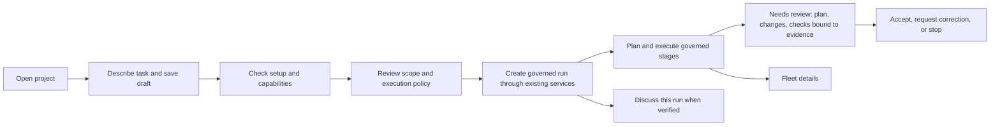

# TORQ task workspace: dashboard review and implementation plan

Status: proposed, not implemented. Reviewed 2026-09-16, revised the same day after a second research pass. Scope: TORQ CLI in E:/Torq-CLI.

Product goal, stated by the user on 2026-09-16: use TORQ CLI the way Google Antigravity, the Codex app, and Claude Code are used. Describe a task in ordinary language, get a plan, let the agent edit files and run commands, review the diff and checks, and iterate. The current dashboard cannot do this: its chat runs the provider with no tools and in plan mode, bound to an existing run. Everything below is in service of closing that gap without giving up the evidence guarantees those tools do not have.

| What those tools do | TORQ today | Where this plan delivers it |
|---|---|---|
| Open a folder and start typing | Requires an existing run directory and a certified receipt chain | P0 entry states, P2 project selection and start service |
| Agent proposes a plan, user approves | Chat is plan-only with no execution path | P2 execution policy and accepted plan revision |
| Agent edits files and runs commands | Chat adapter passes an empty tools list | P2 governed run creation through existing services; never by unlocking the chat adapter |
| Review a diff and test results, then accept | Fleet shows evidence counts and lanes, not a diff | P3 Plan, Changes, and Checks views under the artifact integrity rules |
| Ask a follow-up and continue | No session persistence in the chat adapter | P1 drafts during work, P3 revision requests and task continuation |
| Get notified when it needs you | None | P1 notifications |

P0 and P1 make the dashboard honest and usable. P2 is the phase that makes it a build tool. Do not call the goal met before P2's exit gate passes.

Recommendation: make the default dashboard a task workspace where a user describes a goal, reviews a plan, starts governed work, and inspects the result with the evidence beside it. Retain Fleet as the detailed operations view. Preserve the existing trust gate and introduce an honest entry path before it. Ship the new Home as an opt-in view first; never switch an existing user's default silently.



## What the repository actually does

This was a source and contract review, not a live authenticated browser audit. No provider was called, credentials changed, or live run started. Existing untracked launcher/demo artifacts were inspected, not edited. The old TORQCLAW memory refers to another repository and is not this product's current implementation authority.

| Priority | Finding and evidence | User consequence | Fix |
|---|---|---|---|
| P0 | `safety/chat_evidence.py:_certified_operator_key` requires receipt verification of `verified` or `live_catching_up` and a certified `operator_gateway` public key. | An empty or demo entry cannot act as a general build conversation. | Keep this boundary; offer draft, setup, and start-task capabilities separately. |
| P0 | `adapters/chat_provider.py:ChatProviderCommandFactory` invokes Claude with an empty `--tools` argument, `--permission-mode plan`, disabled slash commands, and no session persistence. | Unlocking this chat does not create an implementation agent. | Label current chat as run discussion; execute builds through the governed run service. |
| P0 | The untracked `torq-cli-dashboard.ps1` sets `runRoot` to `torq-demo-runs`. `RunController` creates `run-*` children; `FleetProjector` expects evidence directly inside its selected root. | The launcher supplies a collection directory to a single-run view. | Distinguish run collection and selected run. Present a run picker; never silently pick an arbitrary child. |
| P1 | `data/fleet/index.html` leads with GOVERNED FLEET, GOVERNANCE SIGNAL RAIL, VERIFIED REDUCER, profile, evidence counts, lanes, and sequence numbers. | The user must understand implementation concepts before finding useful work. | Put goal, next action, progress, and result first; move full technical state to Details/Fleet. |
| P1 | `chat.js:updateControls` disables typing when unavailable and while a turn is active; `applySnapshot` displays a raw finding. | Blocked users cannot prepare their task and have no guided next step. | Keep draft editing available independently; gate submission with an explanation and a recovery action. Do not imply queued dispatch. |
| P1 | `index.html` advertises files for chat; the Claude adapter rejects all attachments. | The UI promises an operation the selected provider cannot perform. | Server-provided capability metadata drives accepted files and help text. |
| P1 | There are separate Add context and chat composers with different semantics. | Sending instructions can mean recording future context or calling a provider. | One primary composer with an explicit purpose; place future-attempt context in task details. |
| P2 | A dense summary, lane board, settlement panel, and fixed command rail share the main page. | Attention is spread across operational telemetry. | Calm spacing, restrained color, a central conversation, and a full-height review panel when review is required. |

The quoted diagnosis is accurate about the trust prerequisite but insufficient as a product resolution. The launcher path mismatch is an additional issue. Neither fixing that path nor obtaining a certificate alone establishes provider readiness, platform support, or build capability. The plain `torq run` path also has a separate `--live` branch; do not promise that any invocation automatically creates a live working builder.

## Research evidence and limits

Research accessed 2026-09-16 using agent-reach: doctor, Exa through mcporter, Reddit OpenCLI reads, and GitHub issue reads. Broad Reddit search returned noisy matches; targeted thread reads and Exa-indexed threads supplied the usable material. This is a purposive qualitative sample, not a representative sentiment survey or model ranking. Posts describe the experience on their publication date, not necessarily today's features. No claimed token savings, speedups, or model superiority are treated as measured results.

### What users valued

| Source and publication date | What users valued | Design implication |
|---|---|---|
| [Codex: Anyone Else Really Enjoying the Codex App?](https://www.reddit.com/r/codex/comments/1r6x43w/anyone_else_really_enjoying_the_codex_app/), 2026-02-17; direct thread read | A less cluttered environment, text and code together, easier switching among conversations, adjacent change views. | Project/task navigation, one main conversation, changes beside it. |
| [Codex App Review](https://www.reddit.com/r/codex/comments/1qvc1qf/codex_app_review/), 2026-02-04; Exa excerpt | Projects gathered in one place; completion notifications named as the feature the author "really needed"; a request that all limits be shown consistently. | Recent tasks, an attention inbox, completion notifications early, and usage shown consistently or labelled unknown. |
| [Antigravity switch discussion](https://www.reddit.com/r/google_antigravity/comments/1r7kut6/just_switched_to_google_antigravity_from_claude/), 2026-02-17; direct thread read | Planning, granular control, and visibility. Replies agree on control while strongly disagreeing on model quality. | Reviewable plans and visible scope; do not use model rankings to justify the UI. |
| [Antigravity appreciation](https://www.reddit.com/r/google_antigravity/comments/1twhg6b/appreciation_post_for_antigravity/), 2026-06-04; web-indexed post | Describing features conversationally and reviewing work as it proceeds. | Ordinary-language goals and accessible intermediate results. |
| [Claude Code: plan mode anyone?](https://www.reddit.com/r/ClaudeCode/comments/1nebqsp/plan_mode_anyone/), 2025-09-11; direct thread read | Refining plans, implementing in chunks, reviewing changes. Some replies find extended planning excessive. | Clear plan/run distinction and incremental progress; no compulsory ceremony for small requests. |
| [Claude Code planning workflow](https://www.reddit.com/r/ClaudeAI/comments/1ujkay1/whats_your_current_claude_code_planning_workflow/), 2026-06-30; Exa excerpt | Concern about retaining plans across sessions and managing context. | Durable task goals, plan revisions, resumable task summaries. |
| [The Orchestrator Seat](https://sdd.sh/2026/04/claude-code-desktop-redesign-parallel-sessions/), 2026-04-17; Exa excerpt | Status filtering (running, waiting for input, complete, failed) called "underrated" for finding the session that needs a decision; side chats that do not pollute the main context. | First-class status filter on the task list; run discussion kept out of the execution transcript. |

### What went wrong elsewhere

| Source and publication date | Failure observed | Rule adopted here |
|---|---|---|
| [Codex Desktop issue 40830](https://github.com/openai/codex/issues/40830), undated GitHub issue | Review pane labelled "Last turn" for a historical turn while rendering the newest worktree's diff. Reporter calls it a data-integrity defect and asks for fail-closed behaviour plus a two-turns-disjoint-files regression test. | Every Changes view is bound to one run and evidence sequence; header and hunks come from the same source; fail closed when unresolved. |
| [Codex Desktop issue 25823](https://github.com/openai/codex/issues/25823), undated GitHub issue | On Windows/WSL the Review summary diffed against git's empty tree, reporting the whole repository as deleted and stalling the app. | Define the diff base explicitly and test it on Windows paths. Windows is TORQ's production chat target. |
| [How am I supposed to review changes in this tiny 3 lines window?](https://www.reddit.com/r/codex/comments/1s7hw0a/how_i_am_supposed_to_review_changes_in_this_tiny/), 2026-03-30; Exa excerpt | Changes shown in a small inline preview forced accept-then-review in the git pane, mixed with earlier changes. The author stopped using the app. | The review panel is full height by default in the Needs review state and scoped to the current run's changes. |
| [New "improved" appearance of the app](https://www.reddit.com/r/ClaudeCode/comments/1smdnxg/new_improved_appearance_of_the_app/), 2026-04-15, and [Desktop UX Redesign Disaster](https://www.reddit.com/r/claude/comments/1sn4l00/desktop_ux_redesign_disaster_part_one_blue/), 2026-04-16; Exa excerpts | Users lost their layout mid-work with no way back; one compares it to cockpit instruments changing in flight. | New Home is opt-in first; the chosen default view persists per user; Fleet stays one click away. |
| [Claude Code issue 55936](https://github.com/anthropics/claude-code/issues/55936), reported around May 2026 | "New session" doubled as the folder picker, and recent sessions were conflated with recent folders. | Open project and New task are separate entry points; Recent projects and Recent tasks are separate lists. |
| [Claude Code Desktop after the redesign](https://nimbalyst.com/blog/claude-code-desktop-after-the-redesign/), 2026-04-21; vendor blog with a commercial interest | After a week, dozens of closed sessions cannot be found; browsing is not searching. Separates "running an agent" from "managing agents". | Tasks carry durable titles and goals; search over them lands in P3. Do not build an agent-management console before the single-task journey works. |
| [CopilotKit governed action approval](https://docs.copilotkit.ai/human-in-the-loop/governed-actions), vendor documentation, undated | Approval cards carry what, why, which policy decision, and what happens next, with allow, deny, and require-approval verdicts. | Blocked and pending actions carry a consequence and a policy reference, not only a message. |
| [Cursor cloud agent capabilities](https://www.learncursor.dev/learn/cursor-agents/cloud-agent-capabilities), 2026-06-26; third-party guide | Agents attach screenshots, logs, and recordings to the pull request so a reviewer can validate without checking out the branch. | The Checks panel shows the command, exit code, and evidence sequence, never a bare pass badge. |

[Google's artifact documentation](https://antigravity.google/docs/artifacts/), accessed 2026-09-16, separately confirms plans, diffs, browser recordings, and artifact feedback as product concepts. Vendor documentation corroborates a pattern; it is not customer satisfaction evidence.

Counterevidence still matters inside the positive threads: the Codex thread includes performance and keyboard complaints; the Claude thread questions planning overhead; the Antigravity thread disputes model comparisons. Copy the interaction patterns, not every feature or enthusiastic claim.

## Design principles

1. **The UI never claims more than the server can prove.** Draft, discussion, execution, verification, and acceptance are distinct claims with distinct labels.
2. **Every displayed artifact names its source.** A diff, a check, or a plan revision is bound to a run and an evidence sequence, and the binding is visible.
3. **Fail closed, visibly.** When a panel cannot resolve its source, it shows an error and disables the action. It never shows something adjacent and plausible.
4. **The next action is always on screen.** Every state has one main message and one primary action, with the reason and remedy when blocked.
5. **Drafts are never lost and never smuggled.** A draft survives setup, reconnect, and failure, and it never enters signed evidence until a start is recorded once.
6. **Change is opt-in.** Existing operators keep Fleet until they choose Home. Their choice persists.
7. **Plain words first, canonical terms one click away.** Backend vocabulary stays available in Details for operators and support.

## Intended experience

Assumption: the primary user is a builder who wants to describe work and supervise its completion. An expert operator remains a secondary user with access to Fleet. This assumption follows the user's stated desire to type and build and should be tested before expanding scope.

### Sidebar and navigation

```text
TORQ                                        Project: Torq-CLI  v  |  Settings

Open project      Recent projects: Torq-CLI, fleet-ui, demo (sample)
+ New task
Tasks             [All] [Working] [Needs review] [Complete] [Failed] [Disconnected]
  ● Add password reset          Needs review      2 min ago
  ○ Fix flaky receipt test      Working           step 3 of 5
  ✓ Rename settlement fields    Complete          yesterday
Fleet details
```

Open project and New task are separate actions. The status filter uses the same words as the state table below. Needs review sorts to the top by default. The sidebar collapses to a drawer on narrow screens.

### Home: empty state

```text
What would you like to work on in Torq-CLI?

[ Describe a feature, bug, or question...                                   ]
[ Fix a bug ]  [ Plan a feature ]  [ Review code ]        Mode: Plan first  v

[ Continue ]        Draft saved locally. Nothing is sent until you continue.

Setup: provider not connected.  [ Connect a provider ]   [ Explore the sample task ]
```

With no provider configured, Continue saves the draft and opens setup. It must not appear to send an AI message successfully. Explore the sample task opens an explicitly read-only sample with a persistent "Sample" label. No demo is silently seeded as the user's working project.

### Active task: Working

```text
Add password reset                                      Working  ·  step 3 of 5

Conversation                                  | Progress          [ Details v ]
  You: Add a password reset flow using the    | ✓ Read auth module
  existing email service.                     | ✓ Plan accepted (rev 2)
  TORQ: Plan accepted. Starting step 3,       | ● Writing reset handler
  writing the reset handler.                  | ○ Add tests
                                              | ○ Run checks
  [ Add a follow-up for the next step...    ] |
  Sends when the current step finishes.       | Usage: unknown until settled
  [ Stop ]                                    | Evidence: seq 41, verified
```

The composer stays editable while work runs. The helper text states exactly when the follow-up will be delivered; it never implies immediate injection. Stop shows "Stop requested" until ownership confirms termination. Streamed output is labelled provisional until it is settled into evidence.

### Active task: Needs review

```text
Add password reset                                             Needs your review

Conversation (collapsed)   |  [ Plan ] [ Changes ] [ Checks ]        run-0042 · seq 44
                           |
  Show conversation  >     |  Changes: 4 files, +126 / -6, bound to seq 44
                           |  src/auth/reset.py          +88  -0
                           |  src/auth/routes.py         +21  -3
                           |  tests/test_reset.py        +17  -0
                           |  docs/auth.md               +0   -3
                           |  ┌───────────────────────────────────────────┐
                           |  │ full-height diff of the selected file     │
                           |  │ ...                                       │
                           |  └───────────────────────────────────────────┘
                           |
                           |  Checks: pytest tests/test_reset.py  exit 0  seq 43
                           |          ruff check src/auth         exit 1  seq 43
                           |          1 check failed. Not marked passed.
                           |
[ Accept changes ]  [ Request a correction ]  [ Stop ]
Accepting records your decision in evidence. It does not push, merge, or deploy.
```

The review panel takes the full content width; the conversation collapses to a toggle. The header, file list, counts, and hunks all come from the same evidence sequence, which is printed. A failed check stays visibly failed. The primary action states its consequence in one sentence. If any artifact cannot be resolved, the panel shows "Changes for this run could not be loaded" and the Accept action is disabled.

### Blocked and recovery states

```text
Add password reset                                                    Paused

This task's history could not be verified.
Why: the receipt chain for run-0042 ended before seq 44.
What you can do: [ Inspect details ]  [ Choose another task ]
Your draft is saved.
```

Every blocked state shows why, what the user can do, and that the draft is safe.

### Narrow screens and accessibility

On widths under a laptop breakpoint, the sidebar becomes a drawer and the Conversation, Plan, Changes, and Checks views become tabs; three columns are never squeezed. Default to the system theme and retain light/dark selection. Use sentence case, readable body text, clear focus rings, and semantic state labels. Reserve red for actual errors and amber for a required user action. Avoid decorative grids and repeated status badges. Preserve keyboard navigation, reduced-motion support, and screen-reader announcements for state changes without reading every streamed token.

### Vocabulary

| Fleet term | Workspace label | Where the canonical term remains |
|---|---|---|
| Governed lanes | Team activity | Details |
| Operator ledger | Needs your attention | Details |
| Evidence-backed usage | Usage | Details, with source |
| Verified seq | Evidence details, with the seq number shown | Review panel header and Details |
| Governed conversation | Discuss this run | Composer purpose label |
| Run root | Project | Details |

A completed process, a verified record, a passed check, and accepted changes remain four distinct claims with four distinct labels.

## Capabilities and state contract

Do not model everything as one `runtimeAvailable` boolean. Introduce an additive server-owned capabilities response, proposed `GET /api/v1/workspace`, with independent run selection, provider configuration, authorization, verification, and execution readiness.

Suggested fields: `selected_project_id`, `selected_run_id`, `draft_supported`, `can_discuss_run`, `can_start_task`, `can_cancel`, `can_accept`, `attachment_types`, `limits`, `usage_source`, `default_view`, and structured `pending_actions` and `blocked_actions`. Each action entry carries `action`, `verdict` (`allow`, `deny`, `require_approval`), `reason_code`, `message`, `consequence`, `remediation`, and `policy_ref`. Provider configuration is not proof of successful authentication; expose unknown separately from ready. All mutations recheck their prerequisites server-side.

| State | Main message | Available action |
|---|---|---|
| No project | Open a project to get started. | Open project; explore sample; edit draft. |
| No task | What would you like to work on? | Edit draft; continue. |
| Provider missing | Connect a provider to continue. | Preserve draft; open setup. |
| Sample | You're exploring a sample task. | Read sample; start a real task. |
| Collection selected | Choose a task to open. | Select validated run entry. |
| Run not trusted | This task's history could not be verified. | Inspect details; select another task; explicit recovery where supported. |
| Ready for run discussion | Ask about this task. | Submit discussion; no claim of file editing. |
| Working | TORQ is working on step N of M. | Edit a follow-up draft; stop; inspect progress. |
| Needs review | Review the plan, changes, or checks to continue. | Exact eligible action with scope and consequence. |
| Complete | This task is complete. | Open result; start a follow-up task. |
| Failed | This task stopped with an error. | Read the error; retry where supported; start a new task. |
| Disconnected | Reconnect to check task status. | Preserve draft; refresh session; no blind replay. |
| Stop requested | Stop requested; process status is not confirmed. | Recovery workflow; no successful-stop claim. |

Persist drafts in a separate workspace draft store with an explicit retention and delete policy. Never insert unsent drafts into signed run evidence. In the initial cosmetic phase, in-memory drafting is acceptable but must not claim reload persistence. A draft revision transferred into a run is recorded once, with its task and run identity; double-click and retry must not start duplicate jobs.

## Artifact integrity rules

These apply to the Plan, Changes, and Checks views and are release gates for P3.

- **Binding.** Each view resolves from `(run_id, evidence_seq)`. The pair is printed in the panel header.
- **Single source.** File list, counts, paths, and hunks are derived from the same resolved artifact. No view mixes a header from one sequence with content from another.
- **Diff base.** The base is the run-start snapshot recorded in evidence, never HEAD, origin, or an empty tree. The base identity is available in Details.
- **Scope.** The default Changes view shows only this run's changes. Earlier runs are reachable through the task list, never merged into the current view.
- **Fail closed.** If resolution fails, the panel shows an explicit error and disables Accept. It never falls back to the latest available artifact.
- **Checks are evidence, not badges.** Each check shows its command, exit code, and sequence. A missing check is stated as missing. A failed check cannot be hidden by a summary state.
- **Regression tests.** Two runs with disjoint file sets each resolve to their own diff; a run with a missing artifact fails closed; the Windows path form of the run-start snapshot resolves correctly.

## Technical design by layer

| Layer | Responsibilities and interfaces | Failures, tests, and dependencies |
|---|---|---|
| Core logic / agent behavior | Add workspace and task-start application services. Reuse `application/setup.py`, `run_command.py`, and `live_runtime.py` where applicable. Keep existing run conversation separate from execution. | Audit the actual start lifecycle before wiring it; prove first-run bootstrapping works without a prior completed run. Refuse unsupported execution and stale plan revisions. |
| Data and integrations | Opaque project and run IDs map to server-approved directories. Capability metadata comes from adapters and policy. Provider credentials stay server-side. Artifact resolution is by `(run_id, evidence_seq)`. | Reject path traversal and invalid roots. Do not probe a paid provider merely by opening Home. Explain authentication, quota, and connectivity failures separately. Test artifact resolution on Windows paths. |
| State and memory | Separate draft, accepted plan revision, run binding, provisional output, and signed terminal transcript. Idempotent start tokens and restart recovery. Per-user default view and status filter preferences. | Test reload, two tabs, repeated start, crash after acceptance, and pending plan revision. Reuse existing single-owner guarantees. |
| Interface surfaces | Rework bundled HTML/CSS/JS; introduce the workspace view and retain Fleet details. New workspace and start routes are proposals, not existing APIs. No framework migration needed. | Test empty state, wrong root, provider mismatch, narrow layout, focus, drafts during work, full-height review, and truthful disabled actions. |
| Governance and safety | Reuse verification, certificate, exact-origin mutations, session rotation, and process ownership. A task-start coordinator invokes the existing authority path; it never manufactures evidence to unlock chat. Accept records a decision in evidence and performs no push, merge, or deploy. | Negative cases for forged certificates, stale sessions, unauthorized roots, invalid providers, start replay, and accept replay. Windows is the current production chat target; other platforms need explicit capability refusal. |
| Observability and feedback | Show next action, timestamps, reconnect status, check results with exit codes, usage with its source, and expandable evidence. Completion and needs-review notifications behind a browser permission prompt. Redacted local UX events for diagnostics. | No prompts, credentials, or full paths in analytics or notifications. Unknown cost remains unknown. Provisional output cannot become verified solely because it rendered. |
| Delivery and operations | Ship incrementally in the existing wheel-bundled app. Home is opt-in with a persisted default; Fleet remains reachable. Launcher opens Home or an explicitly selected run. | Test installed-wheel assets, bootstrap and session behavior, route compatibility, restart, and default-view persistence. Roll back navigation separately from stored tasks; never rewrite signed evidence. |

The first-run lifecycle is the largest engineering uncertainty. The current CLI chat is bound to existing run evidence and uses the run directory as its working directory. Repository access, plan generation before execution, and the transition into a governed builder need explicit service contracts. Do not implement this by removing `--tools ""` or changing plan mode on the chat adapter.

## Phased delivery and exit gates

1. **P0: truthful entry and recovery.** Explicit sample, empty, and wrong-root states; individual run selection; separate Open project and New task; plain-language remedies with consequence and remediation; provider-driven attachment controls. Correct launcher behaviour without silently selecting the newest run or killing an unrelated port owner. Exit: no dead-end unexplained chat; selected root and provider capabilities are truthful. Relative effort: small to medium.
2. **P1: task workspace shell.** One main composer, task list with status filter, task titles, attention ordering, collapsible details, drafts editable during work, opt-in Home with a persisted default view, and completion and needs-review notifications behind a permission prompt. Exit: keyboard and narrow-screen flows work; existing Fleet users see no change until they opt in; Fleet controls retain their meaning. Relative effort: medium.
3. **P2: actual goal-to-run journey.** Project selection, setup status, durable drafts, explicit execution policy and scope, and idempotent creation through existing governed services. Exit: a clean configured installation starts and completes one real bounded task through the dashboard without manual run-directory or certificate handling. This phase is necessary for "type and build"; earlier phases alone are not completion. Relative effort: large; lifecycle audit required before scheduling.
4. **P3: review and refinement.** Plan, Changes, and Checks views under the artifact integrity rules; full-height review layout; revision requests; accept recorded as evidence; task continuation; search over task titles and goals. Exit: the user can inspect what changed and which checks ran with their exit codes, request a correction, find a past task by its goal, and return to it. Never make push, merge, or deploy implicit in accepting. Relative effort: medium to large depending on existing artifact availability.

No calendar estimate is asserted; the live-start integration has not been implemented or timed. Non-goals: rebuilding an IDE, adding new providers, bypassing certificates, simultaneous chat execution, cloud hosting, mobile applications, an agent-management console, or automatic merge and deployment.

## Acceptance and validation

- A new user can enter a goal without an existing run; setup preserves it and explains the next required step.
- Open project and New task are distinct; recent projects and recent tasks are distinct lists.
- Sample content is visibly labelled and cannot dispatch live work.
- The selected run is an actual run directory, never its collection parent.
- UI actions match server capabilities, including Claude's current attachment restriction.
- Every blocked or pending action shows a reason, a consequence, and a remedy.
- Planning and discussion cannot be mistaken for implementation; build starts require the real execution path.
- Signed history is never backfilled from untrusted drafts or provisional stream output.
- Failed setup, start, or reconnect cannot silently lose a draft or duplicate execution.
- Stop remains pending until ownership confirms termination; uncertain cancellation remains visible.
- Every Changes and Checks view prints its run and evidence sequence, resolves from a single source, and fails closed when unresolved.
- The diff base is the recorded run-start snapshot and resolves on Windows paths.
- A failed check is never summarised as passed; a missing check is stated as missing.
- Accept records a decision and performs no push, merge, or deploy; a repeated Accept is idempotent.
- Existing users keep Fleet as their default until they choose Home; the choice persists across restarts.
- The task list filters by the state vocabulary in this document, and Needs review sorts first by default.
- At a narrow phone width, laptop widths, 200% zoom, and keyboard-only use, the composer, review panel, and recovery action stay usable.
- Retain existing chat and Fleet JS harnesses and HTTP and evidence tests; add lifecycle tests for the workspace contract and the artifact integrity regression tests. Include one installed-wheel browser flow and one authorized live bounded task before claiming end-to-end completion.

Proposed usability targets, not measured facts: in five moderated sessions, at least four users identify the next action without explaining run roots or certificates, at least four correctly distinguish Plan, Run, and Sample, and at least four can say from the review screen whether the checks passed and what accepting will do. Measure time to first saved goal, setup abandonment, blocked-chat recurrence, review completion, and time to find a task started the previous day. Validate the main journey before optimising parallel-task features.

Review-time verification: the existing chat and Fleet JavaScript runtime wrappers passed in the focused pytest attempts. The combined provider/UI selection did not pass as a whole: two provider tests could not create temporary directories because of Windows access-denied errors, including a retry using a workspace basetemp. This remains open and must be resolved or explained before P2 scheduling. No live browser or provider integration was tested. These results are baseline checks, not verification of the proposed design.

## Stress test

- **Contrarian, major:** a nicer composer still fails if no start-task service exists. Action: make the clean-install journey a release gate. What would change my mind: an already-working end-to-end dashboard start path.
- **Integrity, major:** a review panel that shows the wrong diff is worse than no review panel, and a shipping competitor has done exactly that. Action: artifact integrity rules are P3 release gates with regression tests. What would change my mind: nothing; this is the product's core promise.
- **Expansionist, minor:** task history and artifacts could make governed execution approachable to more builders, but an agent-management console would recreate clutter. Action: defer orchestration UX; ship search before boards. What would change my mind: observed frequent multi-task demand after first-task success.
- **First principles, major:** a user must express intent before a run can exist. Action: separate draft and setup authority from governed execution authority. What would change my mind: evidence that this dashboard is explicitly only an operations viewer.
- **Researcher, major:** community posts do not validate this audience or implementation. Action: test a clickable journey with target users. What would change my mind: direct task-completion evidence from those users.
- **Existing operator, major:** a forced default switch would repeat the redesign backlash observed elsewhere. Action: opt-in Home with a persisted default. What would change my mind: no active Fleet users at the time of shipping.
- **Buyer, major:** requiring CLI setup and certificate terminology at first use contradicts the intended experience. Action: guide setup and preserve the goal. What would change my mind: target operators consistently prefer CLI provisioning.

**The verdict: RESHAPE.**

**Why:** retain the evidence architecture while changing the entry point, adding the missing creation workflow, and making the evidence visible where the user makes decisions.

**The brutal truth:** the current dashboard exposes internal correctness more clearly than user intent. Cosmetic changes alone cannot turn a restricted run conversation into a build agent, and a review surface that is not bound to evidence would discard the product's main advantage.

**The riskiest assumption:** the governed execution lifecycle can support a straightforward first-task flow without weakening its guarantees.

**The 48-hour cheap test:** prototype the empty Home, setup-needed, working, and needs-review states with the full-height review panel; run moderated task attempts; and run a service-level spike that starts one bounded governed task from a draft and resolves its Changes view from `(run_id, evidence_seq)`. This is a proposed experiment window, not a delivery estimate.

**What would change the verdict:** if real run creation cannot be made available through a supported service, ship a clearly labelled run viewer with the artifact integrity rules and do not market it as a build workspace.

Next action: implement P0 and the first-run lifecycle spike before committing to the full visual redesign.
